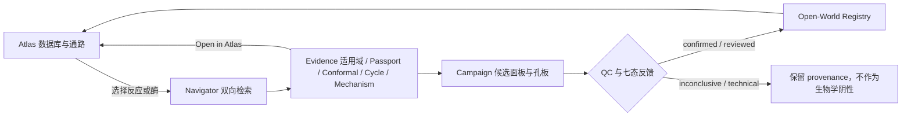
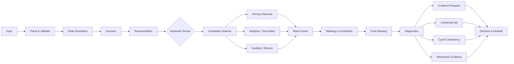

# Terpene Atlas × TerpeneNavigator 统一前端展示总规划（2026-08-05）

## 0. 产品定义

### 0.1 推荐总名称

```text
Terpene Atlas
A database-to-discovery operating system for terpene biodesign
```

产品内部使用四个清晰模块名：

| 模块 | 对用户的含义 | 对应现有资产 |
|---|---|---|
| **Atlas** | 数据库、条目、反应网络和通路 | `igem_database` |
| **Navigator** | Reaction ↔ Enzyme 双向开放世界检索 | TerpeneNavigator production core |
| **Evidence** | 适用域、Evidence Passport、Conformal、循环与机制证据 | competition evidence layer |
| **Campaign** | 候选面板、孔板、QC、七态反馈和下一轮 | wet-lab workflow |

不建议继续并列使用 `Starase Atlas`、`Terpene Atlas`、`TerpeneNavigator` 三个相互竞争的产品名。推荐：

- `Terpene Atlas` 是用户看到的统一产品；
- `Navigator` 是其中的模型引擎；
- `Starase` 可保留为团队内部代号或视觉品牌元素，而不是第三个产品名。

### 0.2 一句话价值

> 用户可以从数据库中的一个化合物、反应或酶出发，沿可交互通路定位问题，调用双向 AI 检索观察完整数据流，审计每个候选的证据与不确定性，再把候选送入可执行湿实验并将结果反馈到下一轮发现。

### 0.3 不变原则

1. 不删减数据库原规划中的任何主要页面或功能；
2. 数据库事实、模型候选和实验反馈必须有明确视觉边界；
3. `score`、Evidence score、Applicability、Conformal coverage 不得被称为活性概率；
4. 页面不仅展示结果，还展示本次查询实际走过的数据流；
5. fancy 来自“真实状态、空间关系和数据运动”，不是无意义的 3D 粒子；
6. 默认视图面向研究人员清晰可操作，比赛模式才进入更强的电影化叙事；
7. 每个视觉元素都能追溯到稳定 ID、route、model bundle、candidate universe 或实验 manifest。

---

## 1. 总体信息架构

### 1.1 一级导航

```text
Explore
  ├─ Atlas Map
  ├─ Entry Search
  ├─ Pathway Search
  └─ Homology Search

Discover
  ├─ Reaction → Enzyme
  ├─ Enzyme → Reaction
  ├─ Batch Discovery
  └─ Open-World Registry

Validate
  ├─ Evidence Studio
  ├─ Conformal Sets
  ├─ Cycle Consistency
  └─ Mechanism Explorer

Experiment
  ├─ Campaign Builder
  ├─ Plate Workspace
  ├─ Assay Feedback
  └─ Next Iteration

Library
  ├─ Enzyme Detail
  ├─ Reaction Detail
  ├─ Compound Card / Detail Drawer
  ├─ Pathway Detail
  ├─ Entry Download Cart
  └─ Pathway Download Cart

System
  ├─ Data Provenance
  ├─ Model Card & Benchmarks
  ├─ Runtime Health
  └─ Data Dictionary
```

### 1.2 产品闭环图



### 1.3 首页不是普通 Dashboard

首页保留上游“地图作为主舞台”的思想，但增加两个层次：

```text
背景层：可交互 Atlas 网络
前景层：统一 Command Bar + 当前数据集 + 数据/模型模式开关
```

首页顶部主控：

```text
[ Atlas | Navigator ] [ 搜索类型 ] [ 输入框 ] [ Run / Search ]
```

- `Atlas`：条目、通路、同源和地图搜索；
- `Navigator`：R2E、E2R、批量或 registry discovery；
- 搜索结果可以在同一地图上定位，但模型运行会进入独立的 Workflow Theater；
- 页面右上永远显示 Entry Cart、Pathway Cart、Campaign 三个计数，不混为一个下载按钮。

### 1.4 三种工作模式

| 模式 | 主视觉 | 主要任务 |
|---|---|---|
| Explore | 暗色沉浸地图 | 发现关系、选择实体、看通路 |
| Workbench | 浅色高密度界面 | 搜索、表格、比较、下载、管理 |
| Theater | 暗色电影化数据流 | 展示模型每一步真实流向与运行状态 |

三种模式共用同一设计 token、状态 badge、字体和导航，不是三个独立站点。

---

## 2. 数据库功能完整保留清单

以下内容是硬性需求，不因模型模块加入而删除。

### 2.1 Atlas Map

必须保留：

- 化合物为节点；
- 酶催化关系为边；
- 多酶同一化合物对聚合为 `N×enzyme`；
- 单边优先显示 UniProt ID，AI 未入库对象显示本库编号；
- 边方向表示 reaction direction；方向由后端依据反应记录、热力学/动力学证据和审核规则生成，前端只展示结果及 provenance，不在浏览器重新推导；
- 边来源区分 Swiss-Prot、TrEMBL、AI literature、manual literature；
- 审核状态区分 pending、reviewed、official、deprecated；
- 节点、画布和浮动卡片可拖动；
- 节点选择后高亮相邻边与邻居节点；
- 重叠边选择后展开具体酶；
- 卡片 hover 与边 hover 双向联动；
- 卡片可加入 Entry Cart；
- 地图可局部扩展和自动定位；
- 用户手动选择优先于搜索结果高亮，取消后恢复搜索状态。

增强而不改变语义：

- 用 WebGL 图层承载大图，React/SVG 只做标签和交互 overlay；
- 使用层级细节 LOD：远景显示聚合簇，中景显示化合物对，近景显示具体边；
- 来源不仅靠颜色，还使用线型/纹理；
- 审核状态使用 badge 与光环，不与来源颜色竞争；
- 方向用箭头和轻微流动粒子，`reversible` 为双向流；
- 搜索命中、用户选择、模型候选分别使用三种高亮通道。

### 2.2 Entry Search

必须同时提供：

#### Table 模式

- 本库酶编号；
- UniProt ID；
- Rhea ID；
- 酶英文名称；
- 基因名称；
- GenBank/Gene ID；
- AND/OR/NOT 逻辑检索；
- 来源、审核状态、物种、EC、证据、是否有序列等筛选；
- 排序、分页、列显示、自定义列；
- 批量勾选加入 Entry Cart；
- 点击进入酶详情。

#### Graph 模式

- 命中边在 Atlas 中一级常亮；
- 结果卡片作为侧边列表；
- 卡片 hover 对应边二级高亮；
- 筛选掉的卡片与边同步退出高亮；
- 切换卡片时地图平滑定位；
- 用户手动选择覆盖结果面板，取消后恢复结果模式。

### 2.3 Pathway Search

输入必须明确角色：

```text
Start compound
Via compounds（可多个、有序或无序）
End compound
Max steps
Source/review filters
```

结果必须：

- 仅以图为主；
- 同时展示多个 Pathway Cards，而不是只取第一条；
- 卡片摘要只显示化合物路径，不在摘要中塞入所有酶；
- 结果阶段不展开重叠边；
- 选择某通路后只高亮其 compoundIds、edgeIds、edgeGroupIds；
- 支持步数、证据覆盖、官方边比例、AI 边数量等筛选；
- 可加入独立 Pathway Cart。

### 2.4 Pathway Detail

必须包含：

- 展开重叠边的局部通路图；
- 每一步 reaction card；
- 每段可替代 enzyme 列表；
- compound hover/card；
- enzyme 点击进入 Enzyme Detail；
- reaction 点击打开 Reaction Drawer；
- 数据来源和审核状态；
- 局部图 SVG/PNG 下载；
- 全部酶条目、序列和证据的打包下载；
- “Send pathway step to Navigator”入口。

### 2.5 Homology Search

独立页面，不再仅靠“像序列就自动触发”：

- 输入本库 enzyme ID、UniProt ID 或 FASTA/序列；
- E-value 阈值；
- max results；
- 来源范围；
- 异步 job status；
- E-value 升序；
- identity、coverage、length、species；
- Table/Graph 双模式；
- 结果可加入 Entry Cart；
- 与 Navigator 的 E2R/R2E 区分：BLAST 是序列同源检索，不应包装为功能预测。

### 2.6 详情页面

#### Enzyme Detail

- 本库编号、全部名称、UniProt、来源物种；
- 全序列、长度、质量；
- gene/GenBank/NCBI、nucleotide sequence；
- 热力学/动力学参数：参数名、数值、单位、温度、pH、底物条件、测量方法和文献来源；
- 所有反应及 direction、equation、SMILES、Rhea、atom map；
- DOI/PubMed、review status；
- 外部数据库链接；
- 单条直接下载；
- `Find reactions with Navigator`；
- `Find similar enzymes with BLAST`；
- `Open all reactions in Atlas`。

#### Reaction Detail / Drawer

- 反应方程；
- substrate/product 结构；
- Rhea ID、EC、SMILES；
- atom map；
- 方向；
- 已知催化酶；
- 来源与证据；
- 可用的 ΔG、平衡常数、Km、kcat、kcat/Km 等参数及实验条件；
- 方向判定依据和审核状态；
- `Find enzymes with Navigator`；
- `Open in Pathway Search`。

#### Compound Card

原规划允许化合物暂不设独立详情页，因此 v1 保留 card/drawer，不强制新页面：

- 名称、ChEBI、formula、charge、mass；
- structure、SMILES、InChI；
- description、external link；
- 相邻反应与通路入口。

路由层预留 `/compounds/:id`，未来需要时可平滑升级，不破坏 v1 卡片交互。

### 2.7 两套下载系统

#### Entry Cart

下载单位：enzyme/edge entry。

#### Pathway Cart

下载单位：局部图 + 该通路所有 enzyme/reaction/compound。

两者必须：

- 页面、状态和输出文件彼此隔离；
- 支持 preview；
- 字段树选择，包含 protein sequence、gene nucleotide sequence、热力学/动力学参数及其条件与来源；
- CSV/TSV/JSON/FASTA/ZIP；
- pathway 支持 SVG/PNG；
- 可选 external links；
- 详情页可直接下载而不进入 cart；
- 下载文件包含 manifest、schema version、生成时间和数据来源。

---

## 3. 数据库到模型的统一用户旅程

### 3.1 从反应出发

```text
Atlas 选中 Reaction
→ 查看 Rhea/底物/产物/已知酶
→ 点击 Find enzymes with Navigator
→ 自动填入 reaction_id 或 reaction_smiles
→ 用户选择 Top-3/10/20、few-shot seeds、mask、temporary candidates
→ 进入 R2E Workflow Theater
→ 查看候选与证据
→ Open candidate in Atlas / Add to Campaign
```

### 3.2 从酶出发

```text
Enzyme Detail
→ 点击 Find reactions with Navigator
→ 自动填入 enzyme_id 或 sequence
→ 区分 known reaction seeds 与 mask-only reactions
→ 进入 E2R Workflow Theater
→ 查看预测反应、机制与适用域
→ 将 reaction 打开到 Atlas 或加入 Pathway Builder
```

### 3.3 从通路缺口出发

```text
Pathway Detail 中某一步缺少合适酶
→ 该 reaction step 发送到 Navigator
→ R2E 候选
→ 选择准确性排名或实验发现面板
→ 加入 Campaign
→ 实验反馈
→ 经审核写入 Registry
→ Atlas 中该通路边获得 registered/AI/wetlab provenance
```

这是数据库和模型真正融合的核心闭环，而不是在导航栏里简单并排两个页面。

---

## 4. Navigator Query Studio

### 4.1 双入口

首页和 Discover 菜单都提供：

```text
Reaction → Enzyme
Enzyme → Reaction
```

两个页面结构一致，字段语义不同。

### 4.2 Query Composer

#### R2E

主输入二选一：

- reaction ID；
- reaction SMILES。

高级输入：

- known enzyme seeds（few-shot）；
- mask enzyme IDs；
- temporary candidate enzyme CSV；
- Top-3/10/20；
- conformal annotate/expand；
- alpha 0.20/0.10/0.05；
- 普通模式/研究模式。

#### E2R

主输入二选一：

- enzyme ID；
- amino acid sequence/FASTA。

高级输入：

- known reaction seeds（few-shot）；
- mask reaction IDs；
- temporary candidate reaction CSV；
- Top-3/10/20；
- conformal 设置；
- 普通模式/研究模式。

**known seeds 与 mask-only 必须是两个独立输入区。**

### 4.3 输入即时预览

- reaction：canonicalized SMILES、底物/产物缩略图、是否库内；
- protein：序列长度、非法字符、是否与库内 exact match、最近参考；
- seed：数量、是否重复、与 query 冲突；
- temporary candidates：字段映射、去重和校验结果；
- 当前/注册/临时候选数量。

点击 Run 前给出一张“将要执行”的摘要，但不提前猜 route；route 必须由后端真实结果确认。

---

## 5. Workflow Theater：完整数据流的核心展示

### 5.1 页面布局

```text
┌──────────────── Query Header ────────────────┐
│ input / direction / objective / run status  │
└──────────────────────────────────────────────┘
┌──────────── Workflow River ────────┬────────┐
│ 每一步真实数据流和并行路线          │ Live   │
│                                    │ Inspector
├────────────────────────────────────┴────────┤
│ Candidate Table / Atlas Projection / Compare│
└─────────────────────────────────────────────┘
```

Workflow River 是页面主角，不是顶部一个小步骤条。

### 5.2 Theater 总数据流



未实际启用的 lane 必须灰化为 `not executed`，不能在演示中伪装成已运行。

### 5.3 十七个可展开阶段

#### 0. Query Origin

显示：

- 来自手工输入、Atlas entity、Pathway gap、batch 或 registry；
- 原始输入 ID；
- runId、时间、用户设置。

#### 1. Parse & Validate

显示：

- ID/SMILES/sequence 解析；
- 长度、字符、格式；
- canonicalization；
- input audit。

动效：原始文本进入“解析门”，转为结构化 token 和 molecule/sequence ribbon。

#### 2. Entity Resolution

显示：

```text
current library
registered entity
external query
temporary entity
```

以及 exact match、registry version、nearest library ID/similarity。

动效：查询对象落入四个带边界的“域”之一，外部对象停留在边界外而不是被强行吸入库内。

#### 3. Query Scenario

显示：

- R2E/E2R；
- current/external；
- zero-shot/few-shot；
- Top-3/10/20；
- seed 数；
- mask 数；
- temporary candidates；
- conformal mode。

#### 4. Representation

R2E：reaction representation、DRFP/多视图/模型需要的反应特征。

E2R：ESM-C 1152 维输入、序列表示、最近邻特征。

普通用户只看“Reaction Encoder / Protein Encoder”；技术折叠区显示维度、model bundle 和预处理版本。

动效：分子图或序列带被压缩成发光 embedding point，但不展示虚构的神经元活动。

#### 5. Automatic Router

必须展示后端返回的真实：

- route_id；
- route_version；
- ranking_objective；
- score_source；
- model_bundle_version。

当前生产路线可视化：

| 情景 | 路线表现 |
|---|---|
| R2E current | shared direct retrieval |
| R2E external Top-3 | specialized direct route |
| R2E external Top-10/20 | exact-residual direct route |
| E2R current | primary direct route |
| E2R external Top-3 | neighbor hybrid |
| E2R external Top-10 | primary + hard-negative secondary, neural RRF |
| E2R external Top-20 | primary + dual-kernel auxiliary, RRF |

路由节点像“轨道分岔器”，只点亮实际经过的支路，未经过路线灰化且标记 `not executed`。

#### 6. Candidate Universe Assembly

显示当前部署动态口径：

```text
Proteins: 1,391 current + 694 registered + optional temporary/rescue
Reactions: 513 current + 240 registered + optional temporary
Controlled UniProt rescue: 5,672 representatives（仅适用流程）
```

每个来源用堆叠条和可点击分区，展示：

- source count；
- candidate universe version/hash；
- registry snapshot；
- 去重数；
- 临时候选数。

#### 7. Primary Retrieval Lane

显示：

- direct score 或主神经排名；
- 输入候选数；
- 输出排名长度；
- lane latency；
- top candidates 流过动画。

#### 8. Neighbor / Secondary / Auxiliary Lanes

仅在实际路由启用时出现：

- neighbor transfer；
- hard-negative secondary；
- collaborative dual kernel；
- CAGE/UniProt rescue 等受控辅助来源。

每条 lane 使用一致结构：输入 → 变换 → rank list，并明确 `used in production ranking` 或 `evidence only`。

#### 9. Rank Fusion

RRF 不画成数值平均。展示：

- 每条 lane 的 candidate rank；
- route weight；
- RRF constant；
- candidate 如何从多个名次合并到最终顺序。

推荐用“多轨汇流”动画：候选 token 从各路线按名次进入 Fusion Chamber，最终按新顺序离开。

#### 10. Masking & Constraints

显示：

- few-shot seed 被用于路线且从输出屏蔽；
- mask-only 仅被屏蔽；
- duplicate/exact identity 处理；
- temporary candidate audit；
- source filters。

任何被移除项都进入可展开的 `Excluded` 抽屉，不能静默消失。

#### 11. Final Ranking

展示 Top-3/10/20 与原始 score，但明确：

> 排序分数只在本次实际路线内解释，不是催化活性概率，也不能跨路线直接比较。

结果支持：

- Table；
- Atlas projection；
- Candidate comparison；
- Accuracy Ranking / Discovery Panel 双视图。

#### 12. Reliability Diagnostics

四张独立卡：

- nearest-library similarity；
- Top-1 ensemble consensus；
- Top-K set stability；
- empirical ranking reliability。

不要把四项合并成一个“AI confidence 93%”。

#### 13. Evidence Passport

查询级：

- applicability score/tier；
- components；
- recommendation；
- interpretation。

候选级：

- evidence score/tier；
- paths；
- warnings；
- interpretation。

视觉采用六条有标尺的 evidence bars + DAG，不使用面积夸张的雷达图作为唯一表达。

#### 14. Conformal Retrieval Set

显示：

- target coverage：80/90/95%；
- alpha；
- calibrator；
- route/model/universe binding status；
- global/Mondrian group；
- qhat；
- set size 和 universe fraction；
- validation coverage/n；
- annotate/expand；
- truncated 状态。

核心图形：

```text
[ requested Top-K ][ remaining conformal prefix................ ][ outside set ]
```

例如 R2E 90% 可能需要 1,476–1,509 / 2,085 个蛋白，界面必须诚实展示“集合很大”，不能压缩成一个看似精确的小圆环。

固定解释：

> 在绑定的 query-disjoint double-cold 校准协议与可交换性假设下，该集合以边际方式覆盖至少一个已知正例；它不表示集合内每个候选的活性概率，也不保证实验阳性。

#### 15. Cycle Consistency

展示正向候选再反向找回原查询：

```text
query → candidate → reverse query rank
```

每个候选显示：

- reverse rank；
- recovered；
- cycle consistency score；
- reverse route；
- evidence-only badge。

视觉采用可交互回环 Sankey/轨道，不默认改变最终排名。第二轮网格结论明确显示：`0 promotion candidates / evidence_only_no_route_change`。

#### 16. Mechanism Evidence

当查询或候选存在 MARTS mechanism：

- mechanism ID；
- step timeline；
- 18 类 step type；
- substrate/product transformation；
- similarity/coverage；
- evidence source。

当前资产：504 mechanisms、3,395 steps、约 79.99% MARTS pair coverage。

必须展示状态：

```text
mechanism evidence available
not used as deployed primary ranking score
```

没有机制数据时显示 coverage gap，不生成虚构动画。

#### 17. Decision & Handoff

用户可将结果：

- Open in Atlas；
- Add to Entry Cart；
- Add reaction to Pathway Builder；
- Compare candidates；
- Build Campaign；
- Download CSV/JSON/audit；
- Register reviewed external entity（权限控制）。

---

## 6. Candidate Result Explorer

### 6.1 主表字段

#### R2E

```text
Rank
Candidate enzyme ID
Name / organism
Route score
Selection source
Current / registered / temporary / UniProt
Ensemble support
Evidence tier
Conformal member
Cycle recovered
Registry/review status
```

#### E2R

```text
Rank
Candidate reaction ID
Equation / compounds
Route score
Reaction source
Actual route
Evidence tier
Conformal member
Cycle recovered
Mechanism availability
```

### 6.2 展开详情

- 原始 score 和 score source；
- model vote、rank std、set support；
- nearest reference；
- reliability status/binding；
- evidence paths/warnings；
- conformal fields；
- provenance hashes；
- external input audit；
- database facts；
- external links。

### 6.3 比较模式

最多 4 个候选并列：

- 不比较跨 route 的原始 score；
- 比较 rank、来源、evidence、applicability context、cycle、mechanism、序列/反应事实；
- 每一列顶部明确 `same query / same route`；
- 可选择一个 Accuracy candidate 和一个 Diversity candidate 进入 Campaign。

### 6.4 Accuracy Ranking 与 Discovery Panel

两个标签页必须分开：

- `Accuracy Ranking`：完全保持生产 rank；
- `Discovery Panel`：用于实验资源分配，可考虑 novelty、diversity、buildability、assayability、information gain，但必须显示为实验选择层，不能覆盖生产 rank。

---

## 7. Evidence Studio

### 7.1 Query Evidence Overview

一个查询的所有证据在同一页面汇合：

```text
Applicability
Empirical Reliability
Ensemble Stability
Conformal Set
Cycle Consistency
Mechanism Coverage
Input Audit
Route Binding
```

每个模块显示：

- status；
- version；
- source；
- what it means；
- what it does not mean；
- downloadable raw fields。

### 7.2 Evidence Passport Card

视觉结构：

```text
顶部：tier + recommendation
中部：六条可解释 component bars
下部：evidence path DAG
底部：warnings 与 non-probability statement
```

候选 tier：

- priority_candidate；
- supported_candidate；
- review_candidate；
- exploratory_candidate。

### 7.3 Applicability Domain Map

展示 query embedding 相对 current/registered reference cloud 的位置，但必须：

- 标记这是二维投影；
- 显示 nearest reference；
- 不把距离直译成活性；
- 提供 `reference_library / in_domain / near_domain / weakly_supported / far_out_of_domain`。

### 7.4 Conformal Set Explorer

三个视图：

1. `Coverage ruler`：80/90/95% 与集合大小；
2. `Candidate prefix`：排名前缀与集合边界；
3. `Calibration audit`：calibration/test 数、validation coverage、binding hashes。

### 7.5 Cycle Lab

- 选择前 N 个候选；
- 逐个触发或读取 reverse retrieval；
- 回环动画；
- reverse rank 分布；
- recovered fraction；
- 对照原 rank 与研究用 cycle rerank；
- 永久显示 `production ranking unchanged`。

---

## 8. Campaign：从候选到湿实验闭环

### 8.1 Campaign Builder

输入来源：

- Navigator candidates；
- Atlas selected entries；
- positive controls；
- UniProt rescue；
- manual additions。

选择策略：

- accuracy core；
- sequence diversity；
- novelty panel；
- positive controls；
- replicate allocation；
- budget/plate constraints。

### 8.2 Plate Workspace

必须区分：

```text
pre-randomization design
balanced manifest
canonical randomized layout
uniprot randomized layout
final master campaign
```

初始布局不能显示为“可直接执行”。只有 randomized layout 带 `execution-ready` badge。

可视化：

- 96-well plate heatmap；
- reaction、role、source、replicate 多层图例；
- hover 显示 candidate、reaction、rank、evidence；
- MILP balance audit；
- plate 间反应分布；
- role-slot 随机化检查；
- FASTA/manifest 下载。

### 8.3 七态反馈

必须显示完整七态，而不是简单正/负：

| 状态 | UI 语义 |
|---|---|
| `not_tested` | 未产生测量，不进入模型反馈 |
| `control_failed` | 反应级对照失败，所有发现孔暂不解释 |
| `expression_failed` | 构建/表达技术失败，不是生物学阴性 |
| `detection_inconclusive` | 有测量但不足以下结论 |
| `expressed_no_target_product` | 表达合格、QC 通过、无目标/其他产物；可形成半权重 qualified negative |
| `positive_target_product` | 目标产物确认阳性 |
| `positive_other_product` | 发现其他产物，形成 alternative product observation |

映射到反馈标签：

```text
positive_target_product       → confirmed_positive
expressed_no_target_product   → expression_qualified_negative
positive_other_product        → alternative_product_observation
其余                          → inconclusive
```

### 8.4 QC Firewall

页面先展示 reaction-level QC：

- positive control pass；
- empty-vector negative pass；
- substrate/process blank pass；
- reaction_qc_pass。

只有 QC 通过后才允许解释发现候选。技术失败和控制失败绝不能流入“negative training examples”。

### 8.5 Next Iteration

用闭环河流展示：

```text
confirmed positives
qualified negatives
alternative products
inconclusive / technical failures
        ↓
outcome utility + diversity
        ↓
next panel / expand beyond Top-20 / review registry
```

---

## 9. Atlas 与 Navigator 的联合图层

Atlas Map 增加图层控制，而不是把所有信息同时画在一张图上：

| 图层 | 内容 |
|---|---|
| Database Facts | 官方/已审核数据库边 |
| Literature | AI/manual literature 边 |
| Navigator Candidates | 当前模型查询产生的虚线候选边 |
| Conformal Boundary | 当前 query 的候选前缀，不直接在全图画上千条边，只显示聚合与计数 |
| Wetlab Status | confirmed/qualified negative/alternative/inconclusive |
| Provenance | 来源、review、registry snapshot |

模型候选边必须与数据库事实边有明显差异：

```text
事实边：实线
模型候选：发光虚线
实验确认：实线 + confirmed halo
实验 qualified negative：灰色点划线，不删除原候选 provenance
```

点击模型候选边时，侧栏同时展示 Database Facts 和 Navigator Evidence，两栏不互相覆盖。

---

## 10. 视觉语言

### 10.1 语义颜色

颜色必须固定语义，不可每页重新定义：

| 语义 | 建议色域 |
|---|---|
| Compound | warm amber/gold |
| Enzyme | cyan/blue |
| Reaction | coral/red-orange |
| Database official | emerald |
| Registered/reviewed | teal |
| AI literature pending | violet |
| Model route | electric indigo |
| Evidence/reliability | aqua |
| Conformal uncertainty | magenta |
| Warning/technical failure | orange |
| Confirmed positive | green |
| Qualified negative | slate blue-gray |
| Inconclusive | neutral gray |

来源再用线型/纹理辅助，避免只靠颜色：

```text
Swiss-Prot       solid
TrEMBL           long dash
AI literature    dotted glow
Manual literature dash-dot
```

### 10.2 暗色 Explore/Theater

- 深紫黑而不是纯黑；
- 微弱网格和星尘只作空间深度；
- 非选中节点降低亮度，选中才有强光环；
- 正文最小 14 px，图标签随 zoom 自适应；
- 投影模式提供 high-contrast preset。

### 10.3 浅色 Workbench

- 继承上游浅薰衣草背景和大圆角卡片；
- 降低大面积模糊阴影；
- 用边框、层级和密度建立专业感；
- 表格、卡片和详情共享同一字段组件。

### 10.4 动效原则

- 所有数据流动效必须对应真实 stage event；
- 进入、运行、完成、警告、跳过五类状态有统一时序；
- 并行 lane 同时运行，RRF 时真正汇流；
- 不循环播放无意义的“AI 思考”；
- 支持 `prefers-reduced-motion`；
- 比赛 Demo Mode 可将过渡速度调慢并自动聚焦关键节点。

### 10.5 Fancy 的三个主视觉

1. **Living Atlas**：化合物网络在视口边缘动态扩展；
2. **Route Reactor**：并行检索路线汇入 RRF 的数据轨道；
3. **Evidence Halo**：候选周围不是一个模糊 confidence 圈，而是分层显示 applicability、conformal、cycle、mechanism 和 wetlab provenance。

---

## 11. 页面级线框说明

### 11.1 Landing / Atlas Home

```text
Logo + dataset selector + system health
Unified command bar
Full-screen graph
Left: selection card
Right: layers / carts / graph controls
Bottom: counts + provenance legend + live registry version
```

### 11.2 Search Library

```text
Left navigation
Top query builder
Filter chips + advanced logic builder
Center Table/Graph toggle
Right sticky detail
Batch actions + Entry Cart
```

### 11.3 Pathway Search

```text
Start / Via / End composer
Pathway result cards left
Atlas local graph center
Pathway properties right
Pathway Cart bottom drawer
```

### 11.4 Navigator Query

```text
Query composer left
Input preview right
Run summary bottom
Previous runs/history side drawer
```

### 11.5 Navigator Result / Theater

```text
Workflow River top 55%
Live Inspector right 25%
Candidate table bottom
Evidence/Conformal/Cycle tabs as deep views
```

### 11.6 Candidate Detail

```text
Database facts | Model evidence | Experimental status
Reaction/sequence preview
Route contribution
Evidence passport
Open in Atlas / Compare / Campaign
```

### 11.7 Campaign

```text
Selection funnel
Budget and diversity controls
Candidate matrix
Plate preview
QC controls
Generate balanced/randomized layout
```

### 11.8 System & Provenance

```text
DB dataset versions
Registry snapshot
Model bundle/route version
Candidate universe hash
Conformal calibrator binding
Runtime health
Downloadable model card and audit manifest
```

---

## 12. 前后端架构规划

### 12.1 不直接修改只读上游

`external_repos/igem_database` 保持只读。正式统一前端代码应放在主仓库新的活动项目，例如：

```text
projects/active/terpene_atlas_frontend/
```

数据库适配器和模型 BFF 也放在主仓库，不在嵌套仓库打补丁。

### 12.2 API 命名空间

统一网关推荐：

```text
/api/atlas/v1/...       数据库、图、条目、通路、同源、下载
/api/navigator/v1/...   R2E/E2R、batch、registry、evidence
/api/campaign/v1/...    panel、plate、feedback、next iteration
/api/system/v1/...      health、versions、provenance
```

网关内部可转发现有：

- 数据库 `/api/v1/...`；
- 模型 `/rank/enzymes`、`/rank/reactions`、`/registry/status`；
- 后续 campaign service。

### 12.3 Query Run DTO

推荐新增面向前端的运行对象：

```json
{
  "runId": "run_...",
  "status": "queued|running|completed|failed",
  "query": {},
  "scenario": {},
  "route": {},
  "candidateUniverse": {},
  "stages": [
    {
      "stageId": "route",
      "status": "completed",
      "startedAt": "...",
      "finishedAt": "...",
      "inputSummary": {},
      "outputSummary": {},
      "artifacts": []
    }
  ],
  "candidates": [],
  "evidence": {},
  "downloads": []
}
```

现有 `RetrievalEngine` 的 `query`、`candidates[i].evidence_passport` 和 `query.conformal_retrieval_set` 可直接映射；前端不需要重新计算。

### 12.4 运行事件

长查询、cycle、batch 和 wetlab 任务使用 SSE 或 WebSocket：

```text
run.created
stage.started
stage.progress
stage.completed
candidate.partial
run.completed
run.failed
```

动画只由这些事件驱动。普通快速查询也可由 BFF 将同步结果转换为一组已完成 stage，保持界面一致。

### 12.5 稳定 ID 与深链接

推荐路由：

```text
/atlas/compounds/:compoundId
/atlas/enzymes/:enzymeId
/atlas/reactions/:reactionId
/atlas/pathways/:pathwayId
/navigator/runs/:runId
/campaigns/:campaignId
```

查询、图焦点、筛选和选中候选可序列化到 URL，便于比赛演示、协作和复现。

---

## 13. 前端技术栈建议

在上游 React/Vite 基础上演进，而不是完全换栈：

| 需求 | 建议 |
|---|---|
| 应用框架 | React + TypeScript + Vite，固定依赖版本 |
| 路由 | React Router |
| 服务端状态 | TanStack Query |
| 本地交互状态 | Zustand 或小型 reducer stores |
| 数据表 | TanStack Table + virtualization |
| 大图 | Graphology + Sigma.js WebGL；局部精细边可叠加 SVG |
| 数据流/Sankey | D3/visx，自定义 React renderer |
| 科学图表 | ECharts 或 visx，统一 token |
| 动效 | Framer Motion，GPU-friendly transform/opacity |
| 化学结构 | 后端 Rhea/ChEBI SVG；必要时 RDKit.js/SmilesDrawer |
| 任务流 | SSE/WebSocket client |
| 测试 | Vitest + Testing Library + Playwright |
| 契约 | OpenAPI generated types + JSON Schema |

不建议继续让地图、搜索、详情和 force layout 全部堆在一个 2000 行组件中。

推荐组件边界：

```text
AtlasCanvas
GraphLayerController
GraphSelectionStore
EdgeGroupInspector
EntityDrawer
PathwayOverlay
NavigatorWorkflow
RouteLane
FusionChamber
EvidencePassport
ConformalExplorer
CycleLoop
CampaignPlate
FeedbackQC
```

---

## 14. 性能与规模

### 14.1 图性能

- 服务端返回局部图与聚合簇；
- Web Worker 执行 layout；
- WebGL 绘制节点/边；
- 标签按 zoom/importance LOD；
- edge picking 使用 offscreen index；
- 只在选中局部展开具体 multi-edge；
- 视口边缘扩图保留上游交互，但增加 request de-duplication 和 undo。

### 14.2 结果性能

- Top-K 立即展示；
- conformal expand 虚拟列表；
- 大集合只渲染视口行；
- Candidate Detail 按需加载数据库事实；
- cycle analysis 分批返回；
- batch discovery 使用 job table 和分页 artifacts。

### 14.3 缓存与版本

所有缓存键至少包含：

```text
query hash
route version
model bundle version
candidate universe hash
registry version
conformal calibrator hash
```

不允许旧结果在版本变化后无提示复用。

---

## 15. 可访问性与清晰度

- 图中所有实体可通过搜索和列表访问，不强迫用户使用鼠标；
- 键盘可切换节点、边、卡片和结果；
- 来源/状态使用颜色 + 形状 + 文本；
- 高对比和色盲预设；
- reduce-motion；
- 所有图表提供数据表替代；
- molecule SVG 有 alt text；
- sequence 使用等宽字体并可复制；
- 错误说明给出下一步，不只显示红色 toast；
- 中文/英文 UI 文案分离，后端不硬编码界面文案。

---

## 16. 比赛演示模式

### 16.1 三分钟主叙事

#### 0:00–0:30 Atlas

- 从发光的 terpene network 开始；
- 点击一个目标反应；
- 展开多个已知/候选酶和来源；
- 展示数据库不是平面条目表，而是可操作的通路地图。

#### 0:30–1:30 Navigator

- 点击 `Find enzymes with Navigator`；
- 输入自动带入；
- Workflow River 依次点亮：解析 → external/current → route → candidate universe → parallel lanes → RRF → ranking；
- 点击一个候选，显示 Evidence Passport。

#### 1:30–2:10 Trustworthy AI

- 切换 Applicability；
- 展示 90% conformal set 很大，说明系统诚实暴露任务难度；
- 展示 cycle 回环和 `evidence only`；
- 展示机制 step，但明确未冒充生产分数。

#### 2:10–2:50 Campaign

- 选择 accuracy + diversity candidates；
- 生成 balanced/randomized plate；
- 展示七态反馈，强调表达失败不是生物学阴性；
- confirmed positive 回到 registry/Atlas。

#### 2:50–3:00 闭环

```text
Database → AI discovery → Evidence → Experiment → Database
```

### 16.2 Demo Mode 功能

- 固定的 validated demo queries；
- 预加载真实结果，不伪造实时模型；
- stage 自动播放/暂停；
- 演讲者快捷键；
- 高对比投影模式；
- 一键展开技术细节；
- 每个数字可点击查看 provenance。

---

## 17. 分阶段实施计划

### Phase 0：合同与设计系统

交付：

- 统一命名、route 和 design tokens；
- OpenAPI/DTO 适配；
- Query Run schema；
- 正式路由和状态管理；
- 上游功能 traceability test。

验收：不写模型动画前，所有数据库规划项都有页面、接口和 owner。

### Phase 1：数据库完整闭环

交付：

- Atlas WebGL 重构；
- Entry Table/Graph；
- Pathway multi-result + detail；
- Homology job UI；
- Enzyme/Reaction detail；
- Entry/Pathway 双 carts；
- 自定义下载。

验收：数据库原规划无删减，来源/审核/下载语义正确。

### Phase 2：Navigator 基础工作台

交付：

- R2E/E2R composer；
- route card；
- Workflow River 0–11；
- candidate table/detail/compare；
- Atlas ↔ Navigator 跳转；
- audit 下载。

验收：每条 Top-3/10/20 current/external route 都能显示真实 route ID 与 lane。

### Phase 3：Evidence 高级展示

交付：

- Evidence Passport；
- Applicability map；
- Conformal Explorer；
- Cycle Lab；
- Mechanism Explorer；
- model card/system health。

验收：所有代理分数有非概率声明，conformal binding/status 可审计。

### Phase 4：Campaign 闭环

交付：

- Campaign Builder；
- panel/plate/balance/randomization；
- 七态反馈；
- QC Firewall；
- next iteration；
- registry review flow。

验收：技术失败不进入 biological negative，执行使用 randomized layout。

### Phase 5：比赛震撼层

交付：

- Demo Mode；
- route/data particle 动效；
- high-contrast stage mode；
- 演讲脚本与 fallback；
- 全链路录屏和离线包。

验收：断网时仍可用已验证真实 run replay，页面明确标记 replay，不冒充实时。

---

## 18. 需求追踪矩阵

| 原数据库规划 | 统一前端位置 | 保留状态 |
|---|---|---|
| 可拖动局部网络 | Atlas Map | 完整保留并扩展 |
| compound 节点/enzyme 边 | Atlas Graph Schema | 完整保留 |
| 多酶重叠边 | EdgeGroup Inspector | 完整保留 |
| 来源颜色 | Provenance Layer | 保留并增加线型 |
| 反应方向 | Directional Edge Flow | 完整保留 |
| 节点信息卡 | Compound Drawer | 完整保留 |
| 边酶卡片 | EdgeGroup Inspector | 完整保留 |
| hover 双向高亮 | Graph/Card linkage | 完整保留 |
| 条目 Table 搜索 | Entry Search Table | 补齐完整表格 |
| 条目 Graph 搜索 | Entry Search Graph | 完整规划 |
| 逻辑门 | Advanced Query Builder | 补齐 |
| 通路搜索 | Pathway Search | 完整保留 |
| 通路卡片 | Pathway Results | 完整保留 |
| 通路详情局部图 | Pathway Detail | 补齐独立页面 |
| 酶详情 | Enzyme Detail | 保留并增强 |
| 化合物无独立详情 | Compound Drawer | v1 尊重原规划，预留 route |
| Rhea atom map | Reaction Detail | 完整保留 |
| ChEBI structure | Compound Drawer | 完整保留 |
| UniProt/NCBI/Rhea/ChEBI 链接 | Field-level external links | 完整保留 |
| 同源 BLAST | Homology Search | 补齐 job UI |
| E-value 排序 | Homology Table | 完整保留 |
| Entry download cart | Entry Cart | 完整保留 |
| Pathway download cart | Pathway Cart | 完整保留 |
| 两类下载不互通 | Separate stores/routes | 硬性保证 |
| 字段与格式选择 | Download Studio | 补齐 |
| AI 文献来源 | Provenance/Review Layer | 完整保留 |
| AI 每周文献更新 | Data Provenance / Ingestion Runs | 完整保留并显示批次与审核队列 |
| 热力学/动力学参数 | Enzyme/Reaction Detail + Download Studio | 完整保留并补齐结构化条件 |
| 基因序列 | Enzyme Detail + Entry Cart | 完整保留 |
| pending/reviewed/official | Status Badge System | 完整保留 |
| AI 模型接轨 | Navigator + Registry | 系统化扩展 |
| 周期性更新 | Data Provenance Center | 增强 |

---

## 19. 最终验收标准

### 数据库完整性

- 原规划的首页、搜索、通路、同源、详情、双下载体系全部可访问；
- 每个数据库字段有 DTO、显示位置和下载映射，包括基因序列、热力学/动力学参数及实验条件；
- 来源、审核和外链在图、卡、表、详情一致。

### 模型透明度

- 每次查询显示输入类型、实际 route、候选空间、lane、fusion、mask、rank；
- current/external、zero/few-shot、Top-3/10/20 明确；
- 原始 score 不称为概率；
- Evidence、Reliability、Applicability 分开。

### 不确定性

- Conformal 显示目标覆盖、集合大小、绑定和适用范围；
- cycle 明确 evidence-only；
- mechanism 缺失时不虚构；
- 外部和低适用域查询有显著提示。

### 闭环

- 候选可进入 Campaign；
- plate design、balance、randomization 可追溯；
- 七态反馈完整；
- technical failure 与 biological negative 分离；
- feedback 可生成下一轮动作和 registry review。

### 视觉与性能

- 1600×900 比赛大屏可读；
- 图标签不低于可读阈值；
- 1,000+ 结果虚拟滚动；
- reduce-motion/high-contrast；
- 页面在网络失败、API 失败、空结果和旧版本不兼容时有明确降级。

---

## 20. 最终产品画面

用户首先看到一张活的 terpene pathway atlas。点击一个反应，数据库事实沿实线展开；点击 `Navigator`，输入对象被送入一条可见的数据河流，经过实体识别、编码、自动路由、候选宇宙、并行检索和排名融合。候选从河流末端进入结果表，周围依次展开 Evidence Passport、Conformal 边界、Cycle 回环和 Mechanism steps。用户选择候选后，画面切换到真实孔板布局，实验结果通过七态 QC 流回 registry，并最终在 Atlas 中形成带 provenance 的新边。

这就是完整的比赛主张：

```text
不是“做了一个数据库，再放了一个模型按钮”，
而是把数据、检索、证据、实验和更新变成一个可操作、可审计、可视化的闭环系统。
```
