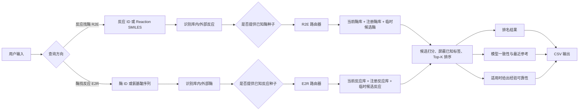
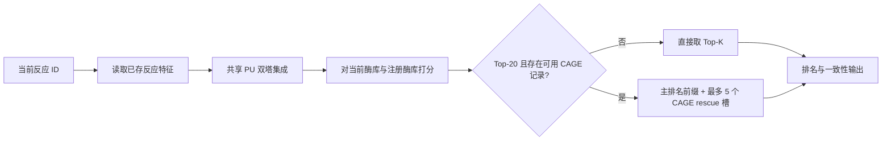
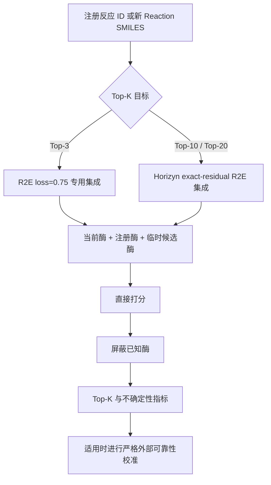
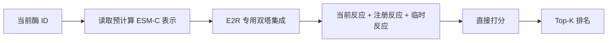
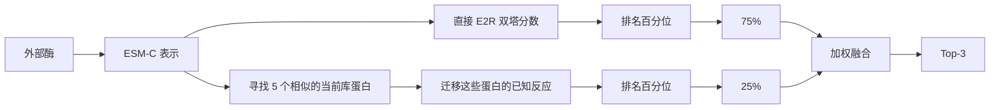
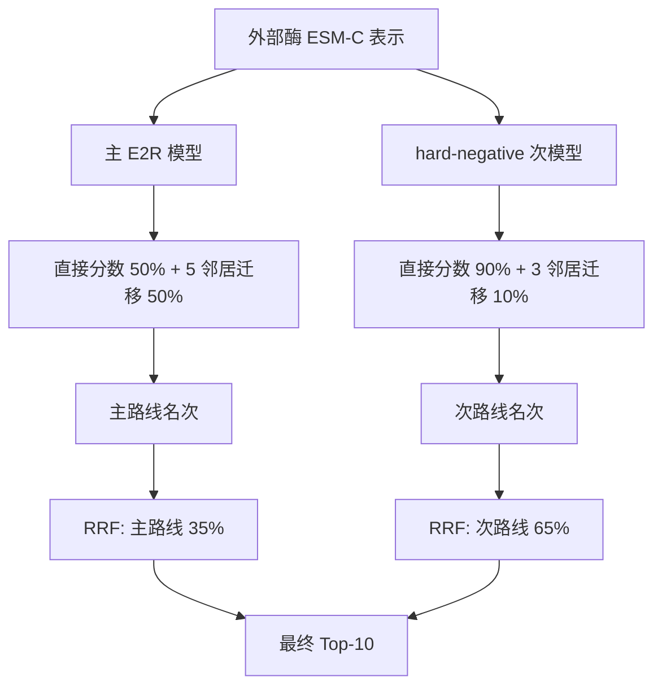
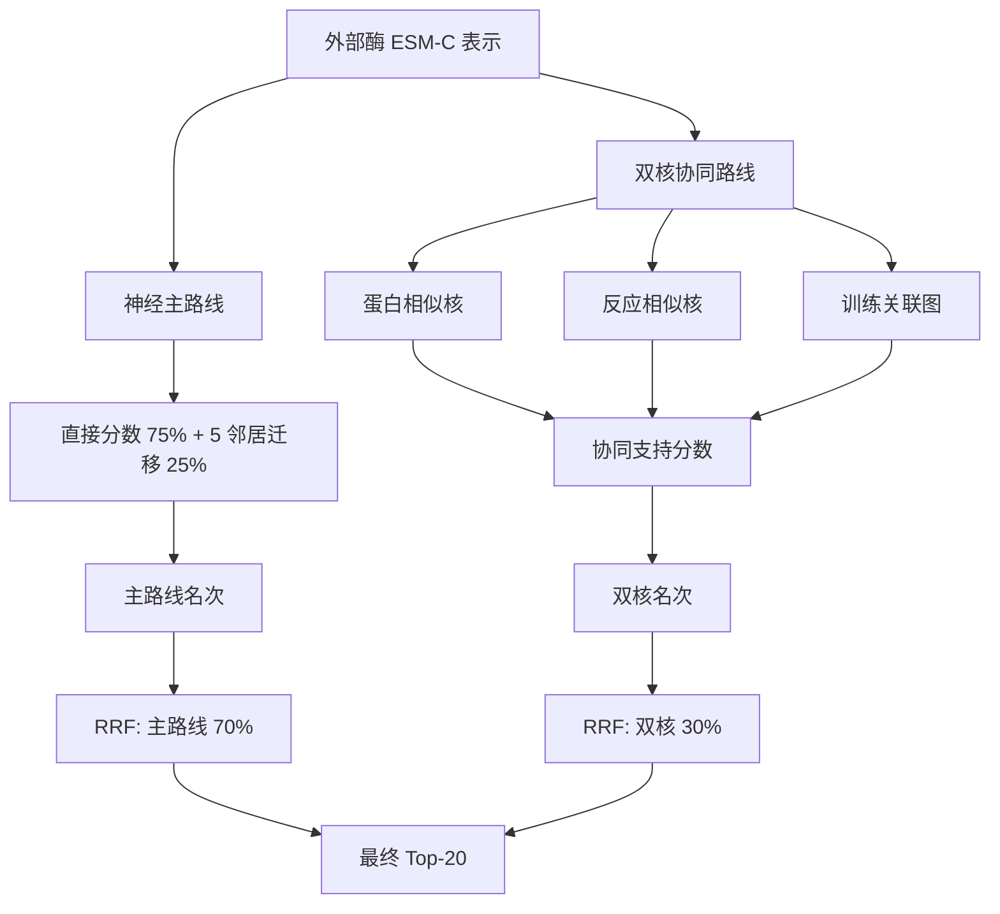
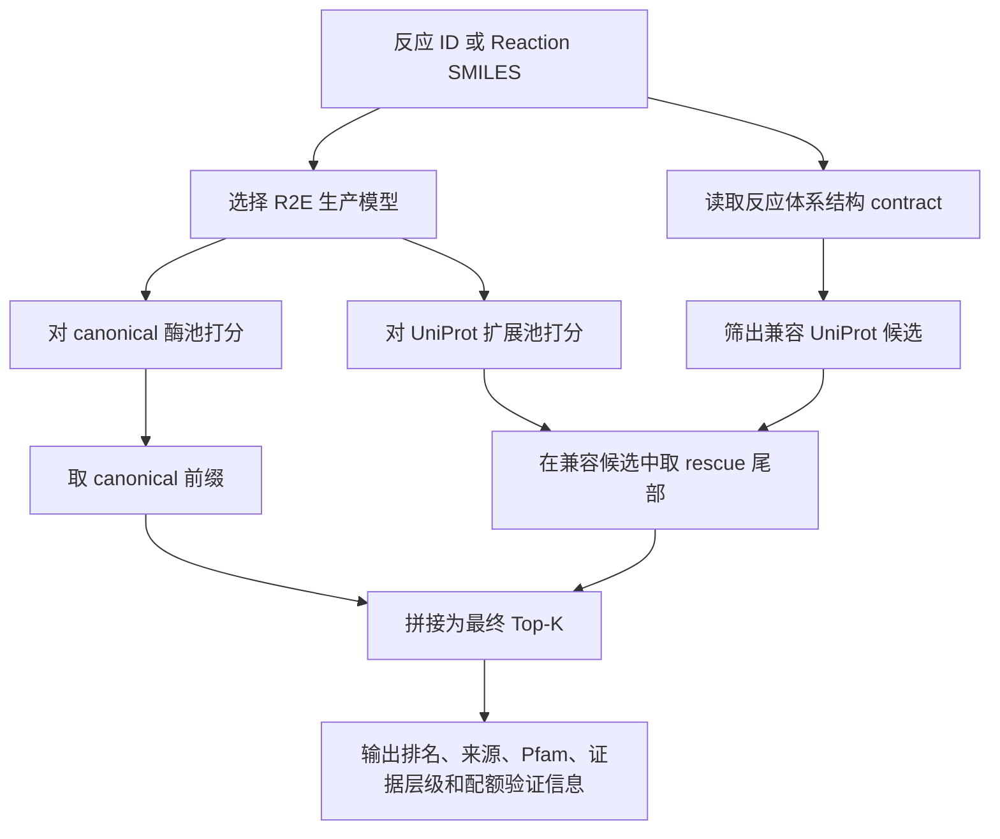
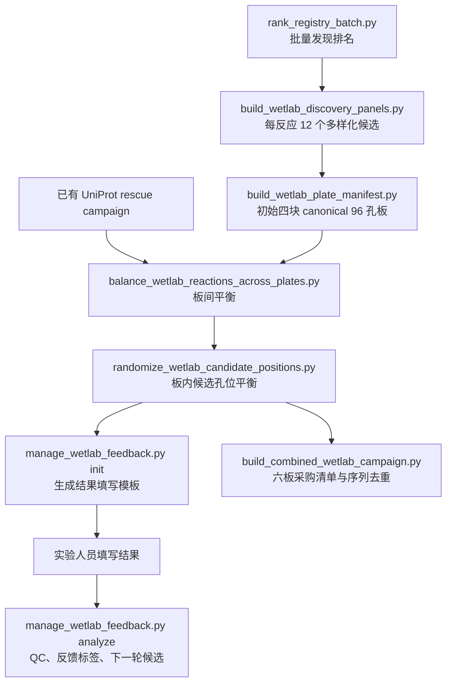

# 萜类合酶检索系统：程序入口、输入输出与前端展示工作流

> 面向负责网页展示和交互封装的项目成员。本文只说明**当前真实可运行的程序入口**、每一步的输入输出、路由规则和推荐展示方式；不规定前端采用什么框架，也不把尚不存在的 HTTP 接口写成现成功能。

- 项目根目录：`/home/s241850073/igem2026`
- 程序目录：`projects/active/terpene_screening/`
- 当前程序形态：Python CLI，输出 CSV / JSON / FASTA
- 最核心在线入口：`rank_open_world.py`
- 推荐运行前先执行：

```bash
cd /home/s241850073/igem2026
```

所有命令均使用项目虚拟环境：

```bash
.venv/bin/python
```

---

# 第一部分　先理解整个工作流

## 1. 系统不是“一个模型输入、一个结果输出”

系统支持两个方向：

1. **Reaction → Enzyme，简称 R2E**：输入一个反应，检索可能催化它的酶。
2. **Enzyme → Reaction，简称 E2R**：输入一个酶，检索它可能催化的反应。

但同一方向内部也不是固定走一条模型路线。程序会继续判断：

- 查询是库内实体还是外部新实体；
- 用户是否提供已知正例作为 few-shot 种子；
- 用户要 Top-3、Top-10 还是 Top-20；
- 是否上传临时候选；
- 是否只屏蔽已知标签；
- 是否使用默认自动路由，还是研究人员手工覆盖路线。

这些条件共同决定实际的数据流。前端最值得展示的，正是这条“**输入分类 → 自动路由 → 候选融合 → 排名与可靠性输出**”链路。

## 2. 总数据流



## 3. 前端展示时建议把一次查询拆成五个阶段

页面不要只显示一个加载动画和一张结果表。推荐展示成以下五步：

```text
① 解析输入
② 识别查询类型
③ 选择检索路线
④ 构建候选空间并融合分数
⑤ 输出排名、证据和可下载结果
```

例如，用户输入一个全新酶序列并选择 Top-20，页面可以显示：

```text
输入：外部酶序列
  ↓ ESM-C 编码
查询类型：外部酶、零样本、Top-20
  ↓ 自动路由
主路线：E2R 专用双塔 + 相似蛋白邻居迁移
辅助路线：双核协同支持
  ↓ RRF 融合
候选空间：当前反应 + 注册反应
  ↓ 屏蔽项与排序
输出：Top-20 反应 + 路由说明 + 一致性指标 + 可靠性层级
```

这比只写“AI 正在预测”更准确，也更能展示项目的技术特点。

---

# 第二部分　核心路由规则

## 4. `top_k` 如何映射到优化目标

普通调用应保留：

```text
--ranking-objective auto
```

此时程序自动映射：

| `top_k` | 自动目标 |
|---:|---|
| 1–3 | `top3` |
| 4–10 | `top10` |
| 11 及以上 | `top20` |

虽然程序允许任意正整数，但当前正式路线围绕 **3、10、20** 三个预算设计。前端推荐只提供：

```text
Top 3　Top 10　Top 20
```

不要默认提供任意数字输入。

## 5. R2E：反应找酶的自动路由

### 5.1 路由总表

| 查询类型 | 有无已知酶种子 | Top-K | 自动采用的主要路线 |
|---|---:|---:|---|
| 当前库内反应 | 无 | 3 / 10 / 20 | 共享 PU 双塔直接检索 |
| 注册或全新外部反应 | 无 | 3 | R2E Top-3 专用模型，直接检索 |
| 注册或全新外部反应 | 无 | 10 / 20 | R2E exact-residual 专用模型，直接检索 |
| 任意反应 | 有 | 任意 | 已知酶种子的序列相似性扩展；种子从结果中屏蔽 |

候选酶空间为：

```text
当前酶库
+ 持久注册酶库
+ 本次上传的临时候选酶（可选）
```

### 5.2 库内反应路线



注意：当满足以下条件时，结果组装阶段可能加入 CAGE rescue：

- 使用 `--reaction-id`；
- 未提供 `--known-enzyme-ids`；
- `top_k >= 20`；
- 对应反应在默认 CAGE 分数文件中存在记录；
- `--cage-rescue-slots` 大于 0，默认是 5。

此时 `score_source` 仍可能显示 `direct`，但每个候选的 `selection_source` 会区分：

- `primary`：主模型排名；
- `cage_rescue`：由结构证据救援进入；
- `primary_fill`：救援槽不足时由主排名补齐。

前端若展示 Top-20，建议用不同标签标出这些来源，而不是把所有行看作同一种候选。

### 5.3 外部反应路线



### 5.4 R2E few-shot 路线

只要 `--known-enzyme-ids` 中至少有一个 ID 存在于候选库，且 `--retrieval-mode auto`，程序会使用：

```text
候选酶与已知酶种子的最大序列表示相似度
```

作为排序分数，并把已知种子从输出中屏蔽。

也就是说，few-shot 不是简单“在直接模型分数上加一点种子信息”，而是自动切换为 `seed` 路线。输出中：

```text
score_source = seed
```

可靠性校准不应用于该路线，因为现有校准器针对外部零样本查询。

## 6. E2R：酶找反应的自动路由

### 6.1 路由总表

| 查询类型 | 有无已知反应种子 | Top-K | 自动采用的主要路线 |
|---|---:|---:|---|
| 当前库内酶 | 无 | 3 / 10 / 20 | E2R 专用双塔直接检索 |
| 注册或全新外部酶 | 无 | 3 | 主模型直接分数 75% + 五个相似蛋白的反应迁移 25% |
| 注册或全新外部酶 | 无 | 10 | 主路线与 hard-negative 次路线分别计算，再做 RRF；最终主/次权重 35% / 65% |
| 注册或全新外部酶 | 无 | 20 | 神经主路线与双核协同支持做 RRF；权重 70% / 30% |
| 任意酶 | 有 | 任意 | 已知反应种子的反应表示相似性扩展；种子从结果中屏蔽 |

候选反应空间为：

```text
当前反应库
+ 持久注册反应库
+ 本次上传的临时候选反应（可选）
```

### 6.2 当前库内酶路线

当前酶有训练库中的直接表示，因此默认不启动外部邻居迁移或双核协同：



### 6.3 外部酶 Top-3 路线



输出的典型 `score_source`：

```text
neighbor_hybrid_direct_0.75
```

### 6.4 外部酶 Top-10 路线

Top-10 不是单模型输出，而是两套完整路线的排名融合。



RRF 使用常数 60。它融合的是**名次**，不是直接把两个原始模型分数相加，因此最终 `score` 的尺度与余弦相似度不同。

典型 `score_source`：

```text
rrf_e2r_top10_primary0.35_secondary0.65_c60
```

### 6.5 外部酶 Top-20 路线



典型 `score_source`：

```text
rrf_e2r_top20_primary0.7_dual_kernel0.3_c60
```

### 6.6 Top-20 双核路线的启用条件

它只在以下条件**同时成立**时自动启用：

- 优化目标是 `top20`；
- 查询不是当前库内酶；
- 没有 few-shot 反应种子；
- `--retrieval-mode auto`；
- 没有手工覆盖模型目录；
- 使用默认 E2R 部署；
- 没有通过 CSV 加入临时外部反应；
- 使用默认持久反应注册表。

只要上传了临时候选反应，双核资产就不能保证与新的候选矩阵完全对齐，因此自动退回神经主路线，不再做双核融合。前端应把这种变化明确显示为：

```text
由于本次加入了临时候选反应，Top-20 双核辅助路线未启用。
```

### 6.7 E2R few-shot 与“仅屏蔽”不是一回事

- `--known-reaction-ids`：这些反应既作为 few-shot 种子，又从输出中屏蔽；自动路线切到 `seed`。
- `--mask-reaction-ids`：只从输出中排除，不作为种子；零样本主路线仍然运行。

前端必须将它们做成两个不同输入区：

```text
已知催化反应（用作 few-shot）
仅排除的已知/不希望返回的反应
```

不要合并成一个“已知反应”字段。

## 7. 路由结果应该怎样展示

推荐在结果页顶部放一张“本次实际路线”卡片：

| 展示项 | 示例 |
|---|---|
| 查询方向 | 酶 → 反应 |
| 查询类型 | 外部酶、零样本 |
| 目标预算 | Top-20 |
| 主路线 | E2R 双塔 + 五邻居迁移 |
| 辅助路线 | 双核协同支持 |
| 融合方式 | RRF，70% / 30% |
| 候选空间 | 513 当前反应 + 240 注册反应 |
| 已屏蔽 | 0 个 |
| 可靠性 | 中等检索证据 |

然后用可展开的数据流：

```text
酶序列
→ ESM-C 1152 维表示
→ E2R 双塔共享空间
→ 直接分数
→ 相似蛋白与其已知反应
→ 邻居迁移分数
→ 神经主路线
→ 双核协同路线
→ RRF
→ Top-20
```

不建议默认展示服务器模型路径。`model_directory`、`secondary_model_directory`、`auxiliary_score_directory` 可以放在“技术详情”折叠区。

---
# 第三部分　核心在线程序

## 8. 总入口：`rank_open_world.py`

程序位置：

```text
projects/active/terpene_screening/rank_open_world.py
```

它只有两个正式子命令：

```text
rank-enzymes     反应 → 酶
rank-reactions   酶 → 反应
```

查看帮助：

```bash
.venv/bin/python projects/active/terpene_screening/rank_open_world.py --help
```

---

## 9. `rank-enzymes`：输入反应，返回候选酶

### 9.1 最简单调用

已有反应 ID：

```bash
.venv/bin/python projects/active/terpene_screening/rank_open_world.py \
  rank-enzymes \
  --reaction-id RHEA:54512 \
  --top-k 20 \
  --output results/web_jobs/demo_r2e/ranking.csv
```

全新反应：

```bash
.venv/bin/python projects/active/terpene_screening/rank_open_world.py \
  rank-enzymes \
  --query-id external_reaction_01 \
  --reaction-smiles 'SUBSTRATE>>PRODUCT' \
  --top-k 10 \
  --output results/web_jobs/demo_r2e_external/ranking.csv
```

### 9.2 主输入必须二选一

| 参数 | 输入内容 | 说明 |
|---|---|---|
| `--reaction-id` | 已存在的反应 ID | 从当前反应库或持久注册表读取 |
| `--reaction-smiles` | 新反应的 Reaction SMILES | 用于外部查询 |

规则：

- 二者至少提供一个；
- 普通前端应要求用户只选一种输入方式；
- 使用新 SMILES 时可用 `--query-id` 指定页面显示 ID；
- 只给不存在的 `reaction-id` 会报错，不能把任意文本当作新 ID。

### 9.3 可选的 few-shot 输入

```bash
--known-enzyme-ids KNOWN_1 KNOWN_2
```

作用：

1. 这些 ID 作为已知催化酶种子；
2. 自动路由切换到 `seed`；
3. 它们本身从输出中屏蔽；
4. 结果寻找与种子相似、但尚未列出的酶。

示例：

```bash
.venv/bin/python projects/active/terpene_screening/rank_open_world.py \
  rank-enzymes \
  --reaction-id MARTS_EXT_RXN_5e756bc9af81 \
  --known-enzyme-ids A0A345ZQ25 A0A345ZQ26 \
  --top-k 20 \
  --output results/web_jobs/demo_r2e_fewshot/ranking.csv
```

### 9.4 临时候选酶 CSV

参数：

```bash
--external-enzymes-csv external_enzymes.csv
```

允许的列名：

| 含义 | 首选列名 | 兼容列名 |
|---|---|---|
| 酶 ID | `enzyme_id` | `Entry` |
| 氨基酸序列 | `sequence` | `Sequence` |

最小示例：

```csv
enzyme_id,sequence
TEMP_E1,MSTHKKK...
TEMP_E2,MAGLAA...
```

这些酶只参与本次查询，不写入持久注册表。程序会现场运行 ESM-C 编码，因此比纯 ID 查询更慢。

### 9.5 普通前端建议暴露的参数

| 参数 | 推荐控件 | 默认值 |
|---|---|---|
| 查询方式 | ID / SMILES 单选 | ID |
| `reaction-id` 或 `reaction-smiles` | 输入框 | 无 |
| `query-id` | 可选文本框 | 自动生成 |
| `known-enzyme-ids` | 标签输入 | 空 |
| `external-enzymes-csv` | CSV 上传 | 无 |
| `top-k` | Top-3 / 10 / 20 | 20 |
| `reliability-policy` | 只标注 / 要求已校准 / 中等以上 / 较高 | `annotate` |

普通页面不应暴露：

```text
--model-dir
--dual-tower-dir
--protein-dir
--registered-protein-dir
--calibrators
--scope
--device
--esmc-model
--hybrid-direct-weight
--retrieval-mode
--cage-scores
--cage-rescue-slots
```

这些参数留给研究或管理员调试。

### 9.6 输出

程序写入一个 CSV，并在标准输出打印表格与简短 JSON：

```json
{
  "output": "/absolute/path/to/ranking.csv",
  "n_results": 20
}
```

CSV 中最重要的字段：

| 字段 | 含义 |
|---|---|
| `query_id` | 查询反应 ID |
| `direction` | 固定为 `reaction_to_enzyme` |
| `score_source` | 本次实际打分路线 |
| `ranking_objective` | `top3` / `top10` / `top20` |
| `rank` | 最终名次 |
| `candidate_id` | 候选酶 ID |
| `score` | 排序分数，不是活性概率 |
| `selection_source` | `primary`、`cage_rescue` 等 |
| `query_nearest_library_id` | 最相似的库内反应 |
| `query_nearest_library_similarity` | 与最近库内反应的相似度 |
| `query_is_current_entity` | 是否是当前库内反应 |
| `is_external_candidate` | 候选是否来自注册或临时扩展 |
| `ensemble_score_std` | 模型成员对该候选分数的分歧 |
| `ensemble_rank_std` | 模型成员对该候选名次的分歧 |
| `ensemble_topk_vote_fraction` | 候选被多少模型成员放入 Top-K |
| `empirical_reliability_score` | 适用时的经验排名可靠性 |
| `empirical_reliability_tier` | `higher_evidence` / `intermediate` / `lower_evidence` / `uncalibrated` |
| `empirical_reliability_status` | 校准是否适用、是否通过验证 |
| `reliability_recommendation` | 推荐怎样使用结果 |

### 9.7 前端结果表建议

主表保留：

```text
名次 | 候选酶 ID | 排序分数 | 候选来源 | 模型投票 | 外部候选标记
```

点开一行后再显示：

```text
模型分数标准差
模型名次标准差
Top-K 投票率
选择来源
最近参考反应
可靠性状态
实际路由
```

不要把完整蛋白序列直接铺在主表中。

---

## 10. `rank-reactions`：输入酶，返回候选反应

### 10.1 最简单调用

已有酶 ID：

```bash
.venv/bin/python projects/active/terpene_screening/rank_open_world.py \
  rank-reactions \
  --enzyme-id 7S5L_A \
  --top-k 10 \
  --output results/web_jobs/demo_e2r/ranking.csv
```

全新酶序列：

```bash
.venv/bin/python projects/active/terpene_screening/rank_open_world.py \
  rank-reactions \
  --query-id external_enzyme_01 \
  --enzyme-sequence 'MSEQUENCE...' \
  --top-k 20 \
  --output results/web_jobs/demo_e2r_external/ranking.csv
```

### 10.2 主输入必须二选一

| 参数 | 输入内容 | 说明 |
|---|---|---|
| `--enzyme-id` | 已存在的酶 ID | 读取预计算 ESM-C 表示 |
| `--enzyme-sequence` | 新酶的氨基酸序列 | 现场运行 ESM-C 编码 |

程序会自动：

- 删除空格和换行；
- 转成大写；
- 删除末尾 `*`。

前端仍应提前检查 FASTA 标题、空序列和明显非法字符。

### 10.3 few-shot 反应种子

```bash
--known-reaction-ids RHEA:12345 RHEA:67890
```

这些反应：

- 用作 few-shot 种子；
- 自动切到 `seed` 路线；
- 从结果中屏蔽；
- 可靠性校准不适用。

### 10.4 只屏蔽、不作为种子

```bash
--mask-reaction-ids RHEA:12345 RHEA:67890
```

这只改变候选集合，不提供 few-shot 信息。

前端必须把两个字段分开：

```text
已知反应种子
仅排除的反应
```

### 10.5 临时候选反应 CSV

```bash
--external-reactions-csv external_reactions.csv
```

允许列名：

| 含义 | 首选列名 | 兼容列名 |
|---|---|---|
| 反应 ID | `reaction_id` | `rhea_id` |
| Reaction SMILES | `reaction_smiles` | `smiles_seq` |

示例：

```csv
reaction_id,reaction_smiles
TEMP_R1,CCC>>C1CC1
TEMP_R2,CCO>>CC=O
```

注意：上传临时反应会让外部酶 Top-20 自动关闭双核辅助路线，因为双核资产只与固定候选矩阵对齐。

### 10.6 输出字段

除与 R2E 相同的排名和可靠性字段外，E2R 还会输出：

| 字段 | 含义 |
|---|---|
| `secondary_model_directory` | Top-10 RRF 次模型目录；其他路线可能为空 |
| `auxiliary_score_directory` | Top-20 双核资产目录；其他路线可能为空 |

前端不需要展示目录本身，但可根据它们和 `score_source` 判断路线中是否存在第二模型或双核分支。

### 10.7 推荐展示

主表：

```text
名次 | 反应 ID | 排序分数 | 当前/注册反应 | 模型投票
```

详情区建议补充反应信息：

```text
Reaction SMILES
底物名称
产物名称
萜类类型
TPS class
候选来源
实际路由
```

这些化学元数据不一定全部直接存在于单查询 CSV；前端可再从注册表或项目元数据表按 `candidate_id` 关联。

---

## 11. 可靠性策略参数

两种检索都支持：

```text
--reliability-policy annotate
--reliability-policy require_calibrated
--reliability-policy require_intermediate
--reliability-policy require_higher
```

| 策略 | 行为 |
|---|---|
| `annotate` | 永不因为可靠性而拒绝，只在结果中标注；推荐默认 |
| `require_calibrated` | 只有存在通过验证的校准器才接受 |
| `require_intermediate` | 只接受中等或较高证据 |
| `require_higher` | 只接受较高证据 |

如果策略不满足，程序抛出错误而不是返回空表。前端应把它显示成：

```text
本次查询已完成，但没有达到所选的最低检索证据要求。
建议改用“仅标注”，或增加已知种子后重新检索。
```

而不是笼统显示“服务器错误”。

---

# 第四部分　持久开放注册表

## 12. 入口：`manage_open_world_registry.py`

程序位置：

```text
projects/active/terpene_screening/manage_open_world_registry.py
```

作用：让新的酶或反应在后续所有查询中持续存在。

它支持：

```text
init
add-enzymes
add-reactions
remove-enzyme
remove-reaction
status
```

注册表默认位置：

```text
data/terpene_open_world_registry/
├── proteins/
│   ├── embeddings.npy
│   ├── entries.csv
│   └── metadata.csv
├── reactions.csv
└── .registry.lock
```

程序使用文件锁和原子写入，避免并发操作写坏注册表。但前端仍应限制为管理员操作。

## 13. 查看状态

```bash
.venv/bin/python projects/active/terpene_screening/manage_open_world_registry.py status
```

输出为标准输出 JSON，例如：

```json
{
  "registry_root": ".../data/terpene_open_world_registry",
  "protein_registry": ".../proteins",
  "reaction_registry": ".../reactions.csv",
  "n_registered_proteins": 694,
  "protein_embedding_shape": [694, 1152],
  "n_protein_metadata_rows": 694,
  "n_registered_reactions": 240,
  "protein_sources": {"marts_registered": 694},
  "reaction_sources": {"marts_registered": 240}
}
```

建议做成系统状态卡：

```text
注册酶：694
注册反应：240
蛋白表示维度：1152
最近状态：正常
```

不要默认显示服务器绝对路径。

## 14. 注册一个酶

```bash
.venv/bin/python projects/active/terpene_screening/manage_open_world_registry.py \
  add-enzymes \
  --enzyme-id NEW_ENZYME \
  --sequence 'MSEQUENCE...'
```

输入：

- `enzyme-id`；
- `sequence`；
- 可选 `source-label`，默认 `user_registered`。

处理过程：

```text
清洗序列
→ 检查 ID 是否与当前库或注册库冲突
→ ESM-C 编码
→ 写入 embeddings.npy
→ 重建 entries.csv 与 metadata.csv
→ 返回更新后的注册表状态
```

输出 JSON 会增加：

```json
{
  "added_or_replaced_enzymes": ["NEW_ENZYME"]
}
```

## 15. 批量注册酶

```bash
.venv/bin/python projects/active/terpene_screening/manage_open_world_registry.py \
  add-enzymes \
  --csv new_enzymes.csv
```

CSV 最小格式：

```csv
enzyme_id,sequence
NEW_E1,MSEQUENCE...
NEW_E2,MSEQUENCE...
```

兼容列名：`Entry` 和 `Sequence`。

管理员选项：

- `--replace`：覆盖同名注册实体；
- `--allow-current-id`：允许与当前基础库 ID 重叠。

这两个选项风险较高，前端默认不要提供。

## 16. 注册反应

单条：

```bash
.venv/bin/python projects/active/terpene_screening/manage_open_world_registry.py \
  add-reactions \
  --reaction-id NEW_REACTION \
  --reaction-smiles 'SUBSTRATE>>PRODUCT'
```

批量：

```bash
.venv/bin/python projects/active/terpene_screening/manage_open_world_registry.py \
  add-reactions \
  --csv new_reactions.csv
```

CSV：

```csv
reaction_id,reaction_smiles
NEW_R1,CCC>>C1CC1
NEW_R2,CCO>>CC=O
```

兼容 `smiles` 作为 SMILES 列名。

程序会：

```text
验证反应可编码
→ 生成 canonical reaction_signature
→ 加入 source 标签
→ 原子写入 reactions.csv
→ 返回注册表状态
```

## 17. 删除注册实体

```bash
.venv/bin/python projects/active/terpene_screening/manage_open_world_registry.py \
  remove-enzyme --enzyme-id NEW_ENZYME

.venv/bin/python projects/active/terpene_screening/manage_open_world_registry.py \
  remove-reaction --reaction-id NEW_REACTION
```

前端应：

- 二次确认；
- 明确显示只删除“注册层”，不能删除基础库；
- 记录操作日志；
- 删除成功后重新获取 `status`。

## 18. 初始化注册表

```bash
.venv/bin/python projects/active/terpene_screening/manage_open_world_registry.py init --force
```

这会从 MARTS 外部实体重新建立整个注册表。它不是普通页面上的“清空”按钮，应只在部署初始化或明确恢复时由管理员运行。

---

# 第五部分　批量发现程序

## 19. `rank_registry_batch.py`

程序位置：

```text
projects/active/terpene_screening/rank_registry_batch.py
```

作用：对持久注册表中的全部酶和反应进行矩阵式检索。模型按路线只加载一次，适合生成展示数据库和后续湿实验输入。

标准调用：

```bash
.venv/bin/python projects/active/terpene_screening/rank_registry_batch.py \
  --direction both \
  --objectives 3,10,20 \
  --output-dir results/terpene_registry_batch
```

### 19.1 主要输入

| 参数 | 含义 | 默认 |
|---|---|---|
| `--direction` | `both`、`enzyme_to_reaction`、`reaction_to_enzyme` | `both` |
| `--objectives` | 逗号分隔预算 | `3,10,20` |
| `--max-queries` | 调试时限制查询数 | 不限制 |
| `--output-dir` | 输出目录 | `results/terpene_registry_batch` |
| `--include-known-associations` | 保留已知 MARTS 关联 | 默认关闭 |
| `--reliability-policy` | 可靠性要求 | `annotate` |

发现模式默认会屏蔽全部可映射的已知 MARTS 关联。不要为了展示方便打开 `--include-known-associations`，否则结果不能解释为新候选发现。

### 19.2 主要输出

```text
results/terpene_registry_batch/
├── enzyme_to_reaction_rankings.csv
├── enzyme_to_reaction_queries.csv
├── reaction_to_enzyme_rankings.csv
├── reaction_to_enzyme_queries.csv
├── discovery_concentration_summary.csv
├── known_association_leaks.csv
├── discovery_audit.json
└── summary.json
```

两类文件的区别：

- `*_rankings.csv`：一行一个候选，适合候选表和详情页；
- `*_queries.csv`：一行一个查询，适合总览卡片、筛选和统计图。

### 19.3 推荐前端页面

批量发现总览可显示：

```text
查询总数
每个方向的 Top-3/10/20 数量
使用了哪些路线
已屏蔽的已知关联数
泄漏审计结果
Top-1 集中度
外部候选比例
```

然后支持：

```text
按查询 ID 搜索
按方向筛选
按目标预算筛选
按候选来源筛选
按模型一致性排序
下载完整 CSV
```

必须突出：

```text
known_association_leaks = 0
```

如果不为 0，应将整个结果标记为审计失败，不应作为发现结果展示。

---
# 第六部分　受控 UniProt 扩展

## 20. 为什么它不是普通候选库合并

UniProt 扩展层包含 5,672 个经过控制的 TPS 候选代表，但不能直接全部混入主候选库。自由合并会明显挤压 canonical 候选的 Top-K 位置。

因此系统采用：

```text
canonical 主排名前缀
+
少量经过体系结构约束的 UniProt 尾部 rescue 槽
```

默认预算：

| Top-K | canonical 槽 | UniProt rescue 槽 |
|---:|---:|---:|
| 3 | 3 | 0 |
| 10 | 9 | 1 |
| 20 | 18 | 2 |

前端应把它展示成两段候选列表，而不是假装所有候选来自同一池。

## 21. 单反应入口：`rank_uniprot_rescue.py`

程序位置：

```text
projects/active/terpene_screening/rank_uniprot_rescue.py
```

标准调用：

```bash
.venv/bin/python projects/active/terpene_screening/rank_uniprot_rescue.py \
  --reaction-id MARTS_EXT_RXN_5e756bc9af81 \
  --top-k 20 \
  --output results/web_jobs/uniprot_demo/ranking.csv
```

### 21.1 输入方式

| 参数 | 含义 |
|---|---|
| `--reaction-id` | 注册反应 ID；可自动读取反应类型和体系结构 contract |
| `--reaction-smiles` | 全新外部反应 |
| `--terpene-type` | 外部反应的萜类类型，可选 |
| `--allowed-architectures` | 外部反应允许的 Pfam 体系结构，逗号分隔 |
| `--top-k` | 推荐 3 / 10 / 20 |
| `--rescue-slots` | 手工指定 rescue 槽数；不填时使用验证默认值 |
| `--family-policy` | `compatible_only` 或 `annotate` |

对注册反应，程序从已有 contract 自动判断允许的候选体系结构。

对全新外部反应，如果没有显式提供 `--allowed-architectures`，程序会把 UniProt rescue 槽自动设为 0，只返回 canonical 候选。这是一项安全设计，不是程序故障。

### 21.2 数据流



### 21.3 输出

程序生成两个文件：

```text
ranking.csv
ranking.summary.json
```

CSV 重点字段：

| 字段 | 含义 |
|---|---|
| `canonical_slots` | 本次 canonical 槽数 |
| `uniprot_rescue_slots` | 实际启用的 UniProt 槽数 |
| `requested_uniprot_rescue_slots` | 原始请求的 UniProt 槽数 |
| `architecture_contract_status` | 反应 contract 状态 |
| `allowed_candidate_architectures` | 允许的候选体系结构 |
| `candidate_source` | `current`、`registered_external`、`uniprot_primary` 等 |
| `selection_source` | `canonical_primary` 或 `uniprot_rescue` |
| `evidence_quality_tier` | UniProt 证据层级 |
| `pfam_combination` | Pfam 域组合 |
| `pfam_architecture` | 归一化体系结构类型 |
| `family_compatibility` | 是否与反应 contract 兼容 |
| `uniprot_registry_query_fraction` | 候选在注册反应中出现的历史频率 |
| `strict_double_cold_hit_retention_fraction` | 该槽位策略在严格压力测试中的原始命中保留比例 |

前端结果卡推荐分组：

```text
Canonical shortlist
1 ... 18

Controlled UniProt rescue
19 ... 20
```

UniProt 行应额外显示：

```text
证据层级 | Pfam 体系结构 | family compatibility | rescue 来源
```

### 21.4 外部反应的推荐展示

如果没有 architecture contract，页面不要只显示“0 个 UniProt 结果”。应解释：

```text
该反应没有经过确认的 TPS 家族体系结构约束。
为避免把 5,672 个扩展候选无控制地混入主排名，本次仅返回 canonical 候选。
```

## 22. 批量入口：`rank_uniprot_rescue_batch.py`

程序位置：

```text
projects/active/terpene_screening/rank_uniprot_rescue_batch.py
```

标准调用：

```bash
.venv/bin/python projects/active/terpene_screening/rank_uniprot_rescue_batch.py \
  --output-dir results/terpene_uniprot_controlled_rescue_batch
```

它对所有注册反应生成 Top-3/10/20 受控扩展结果。

主要输出：

```text
controlled_rankings.csv
query_summary.csv
selected_uniprot_frequency.csv
known_association_leakage.csv
canonical_prefix_mismatches.csv
audit.json
summary.json
```

展示时重点读取：

- `query_summary.csv`：每个反应和预算的一行摘要；
- `controlled_rankings.csv`：完整候选明细；
- `audit.json`：泄漏、前缀和 contract 审计；
- `selected_uniprot_frequency.csv`：扩展候选出现频率和 hub 风险。

若以下任一审计失败，不应把结果标记为正式受控扩展：

```text
known_association_leaks > 0
canonical_prefix_mismatches > 0
all_query_sizes_correct = false
unsupported_with_uniprot_rows > 0
```

---

# 第七部分　湿实验工作流

## 23. 一定要按顺序调用



初始板清单只保留为来源记录。真正执行实验应使用：

```text
results/terpene_wetlab_randomized_layout/
```

中的 randomized manifests 和对应结果模板。

---

## 24. `build_wetlab_discovery_panels.py`

程序位置：

```text
projects/active/terpene_screening/build_wetlab_discovery_panels.py
```

调用：

```bash
.venv/bin/python projects/active/terpene_screening/build_wetlab_discovery_panels.py \
  --output-dir results/terpene_wetlab_discovery_panels
```

### 24.1 输入

主要读取：

```text
results/terpene_registry_batch/
data/terpene_embeddings/esmc600m_mean/
data/terpene_open_world_registry/proteins/
data/terpene_open_world_registry/reactions.csv
data/terpene_marts/marts_reaction_pairs.tsv
data/terpene/enzyme_terpene_synthase.tsv
```

默认每个反应选：

| 角色 | 数量 | 目的 |
|---|---:|---|
| `exploitation` | 6 | 优先测试高排名、高一致性候选 |
| `uncertainty` | 3 | 测试模型分歧较大的信息性候选 |
| `diversity` | 3 | 增加序列空间覆盖 |

默认还会：

- 限制候选间最大序列表示相似度为 0.95；
- 选择 24 个 canonical campaign 反应；
- 选择 8 个 extended-pathway 反应；
- 确保至少 4 个 class-II 反应；
- 排除过短、过长或包含非标准残基的序列；
- 把已知正例单独放入 positive control 表，不作为发现候选。

### 24.2 输出

```text
reaction_discovery_panels.csv
reaction_panel_summary.csv
reaction_positive_controls.csv
campaign_reactions.csv
campaign_discovery_candidates.csv
campaign_positive_controls.csv
extended_pathway_reactions.csv
extended_pathway_candidates.csv
extended_pathway_positive_controls.csv
summary.json
```

前端可做“候选面板设计”页面：

- 每个反应显示 12 个候选；
- 按三种 role 分色；
- 展示原始排名、模型一致性、候选来源、序列长度；
- 显示为什么该候选被选中，而不只显示模型分数。

推荐颜色语义：

```text
exploitation：主色
uncertainty：警示/探索色
diversity：第三强调色
positive control：独立对照色
```

不要让“uncertainty”看起来像错误；它是主动选择的信息性实验对象。

---

## 25. `build_wetlab_plate_manifest.py`

程序位置：

```text
projects/active/terpene_screening/build_wetlab_plate_manifest.py
```

调用：

```bash
.venv/bin/python projects/active/terpene_screening/build_wetlab_plate_manifest.py \
  --panels-dir results/terpene_wetlab_discovery_panels \
  --output-dir results/terpene_wetlab_plate_manifest
```

### 25.1 输入

输入是上一程序生成的候选面板目录。

### 25.2 输出

主要文件：

```text
assay_manifest.csv
TPS_DISCOVERY_P01.csv ... TPS_DISCOVERY_P04.csv
TPS_DISCOVERY_P01_layout.csv ...
sequence_deduplicated_constructs.csv
unique_constructs.csv
constructs_needing_manual_review.csv
candidate_id_constructs.fasta
sequence_deduplicated_constructs.fasta
plate_summary.csv
summary.json
```

每块 canonical 板：

- 96 孔；
- 6 个反应；
- 每反应占两列；
- 12 个发现候选；
- 2 个 positive-control wells；
- 1 个 empty-vector negative；
- 1 个 substrate/process blank。

### 25.3 前端展示

适合做 8×12 的板图：

```text
A1 ... A12
...
H1 ... H12
```

点击孔位显示：

```text
reaction_id
assay_role
candidate_id
panel_role
candidate_source
sequence_construct_id
sequence_length
```

但页面必须在顶部标注：

```text
这是初始布局，仅用于来源记录；请勿直接执行实验。
```

---

## 26. `balance_wetlab_reactions_across_plates.py`

程序位置：

```text
projects/active/terpene_screening/balance_wetlab_reactions_across_plates.py
```

调用：

```bash
.venv/bin/python projects/active/terpene_screening/balance_wetlab_reactions_across_plates.py \
  --output-dir results/terpene_wetlab_plate_balanced \
  --seed 20260723
```

### 26.1 输入

默认读取：

```text
canonical 初始 assay_manifest.csv
UniProt rescue 初始 assay_manifest.csv
UniProt rescue 候选元数据
```

### 26.2 做什么

它把“一个反应对应的完整孔位块”作为不可拆分单位，在不同板间重新分配，优化：

- 萜类类型平衡；
- TPS class 平衡；
- 序列长度分布；
- 外部候选比例；
- UniProt 证据层级和体系结构分布；
- 每板精确容量。

它不会在这一步打乱同一反应内部候选的相对孔位。

### 26.3 输出

```text
canonical_balanced_assay_manifest.csv
uniprot_balanced_assay_manifest.csv
canonical_discovery_reaction_assignment.csv
uniprot_rescue_reaction_assignment.csv
plate_balance_audit.csv
plate_balance_diagnostics.csv
summary.json
```

前端最适合展示“平衡前 / 平衡后”对比：

```text
每板反应类型数量
TPS class 数量
候选中位长度
外部候选比例
A/B/C/D 证据层级数量
```

并用连线图显示每个反应从原板移动到哪块新板。

---

## 27. `randomize_wetlab_candidate_positions.py`

程序位置：

```text
projects/active/terpene_screening/randomize_wetlab_candidate_positions.py
```

调用：

```bash
.venv/bin/python projects/active/terpene_screening/randomize_wetlab_candidate_positions.py \
  --output-dir results/terpene_wetlab_randomized_layout \
  --seed 20260723
```

### 27.1 输入

读取平衡后的 canonical 和 UniProt manifests，以及 plate-balance summary。

### 27.2 做什么

- 保留 reaction block；
- 保留所有 control 和 blank 孔；
- 只重新安排候选孔位；
- 使 exploitation / uncertainty / diversity 或不同 rescue role 不固定出现在某些位置；
- 使用确定性 seed，保证可复现。

### 27.3 输出

```text
canonical_randomized_assay_manifest.csv
uniprot_randomized_assay_manifest.csv
canonical_randomized_assay_results_template.csv
uniprot_randomized_assay_results_template.csv
candidate_well_assignments.csv
role_slot_balance_audit.csv
TPS_*_randomized_layout.csv
summary.json
```

这是前端“正式实验板”页面应读取的目录。

建议提供切换：

```text
初始布局
平衡后布局
正式随机化布局
```

并让用户看到候选从 `original_well` 移动到最终 `well` 的过程。

---

## 28. `manage_wetlab_feedback.py init`

程序位置：

```text
projects/active/terpene_screening/manage_wetlab_feedback.py
```

生成 canonical 结果模板：

```bash
.venv/bin/python projects/active/terpene_screening/manage_wetlab_feedback.py init \
  --manifest results/terpene_wetlab_randomized_layout/canonical_randomized_assay_manifest.csv \
  --output results/terpene_wetlab_randomized_layout/canonical_randomized_assay_results_template.csv
```

生成 UniProt 结果模板：

```bash
.venv/bin/python projects/active/terpene_screening/manage_wetlab_feedback.py init \
  --manifest results/terpene_wetlab_randomized_layout/uniprot_randomized_assay_manifest.csv \
  --output results/terpene_wetlab_randomized_layout/uniprot_randomized_assay_results_template.csv
```

它在 manifest 后添加：

```text
expression_status
soluble_expression
assay_signal
background_signal
target_product_detected
product_identity_confidence
technical_issue
operator_label
notes
```

`expression_status` 允许：

```text
not_measured
failed
low
adequate
high
```

前端最好做成结构化表单，不要让实验人员自由输入这些枚举值。

布尔字段建议只允许：

```text
是 / 否 / 未填写
```

---

## 29. `build_combined_wetlab_campaign.py`

程序位置：

```text
projects/active/terpene_screening/build_combined_wetlab_campaign.py
```

调用：

```bash
.venv/bin/python projects/active/terpene_screening/build_combined_wetlab_campaign.py \
  --output-dir results/terpene_combined_wetlab_campaign
```

### 29.1 输入

- canonical 正式随机化 manifest；
- UniProt 正式随机化 manifest；
- 两类结果模板；
- randomization summary。

### 29.2 输出

```text
master_assay_manifest.csv
master_plate_summary.csv
master_sequence_constructs.csv
master_sequence_constructs.fasta
procurement_summary.csv
campaign_sequence_overlap.csv
feedback_scopes.csv
summary.json
```

它把 canonical 与 UniProt 两个 campaign 的蛋白序列统一去重，形成采购和构建清单，但**实验结果反馈仍必须分开分析**。

前端可以展示：

```text
6 块板
576 个孔
480 个蛋白实验孔
352 个序列去重构建体
总氨基酸数
总编码核苷酸数
跨 campaign 共享构建体数
```

并提供 FASTA 和采购表下载。

---

## 30. `manage_wetlab_feedback.py analyze`

canonical 分析：

```bash
.venv/bin/python projects/active/terpene_screening/manage_wetlab_feedback.py analyze \
  --results completed_canonical_randomized_results.csv \
  --output-dir results/terpene_wetlab_feedback
```

UniProt 分析：

```bash
.venv/bin/python projects/active/terpene_screening/manage_wetlab_feedback.py analyze \
  --results completed_uniprot_randomized_results.csv \
  --rankings results/terpene_uniprot_expansion_quality/expanded_top100_annotated.csv \
  --ranking-objective top100_rescue \
  --additional-protein-dir data/terpene_embeddings/uniprot_tps_primary_esmc600m \
  --output-dir results/terpene_uniprot_rescue_feedback
```

### 30.1 输入要求

结果 CSV 至少需要：

```text
plate_id
well
reaction_id
assay_role
candidate_id
expression_status
target_product_detected
product_identity_confidence
technical_issue
```

程序会拒绝：

- 重复的 `plate_id + well`；
- 缺失必需列；
- 不支持的 expression status。

### 30.2 QC 逻辑

一个反应只有同时满足以下条件才通过 QC：

```text
至少一个 positive control 检出目标产物
empty-vector negative 未检出目标产物
substrate/process blank 未检出目标产物
相关孔没有技术故障
```

候选标签：

| 标签 | 条件摘要 |
|---|---|
| `confirmed_positive` | 反应 QC 通过、检出目标、产物身份置信度达阈值、无技术问题、表达未失败 |
| `expression_qualified_negative` | 反应 QC 通过、未检出、表达充分或低但可溶、无技术问题 |
| `inconclusive` | 其他所有情况 |

未测试组合永远不会自动当作负例；表达失败和 control 失败也不会当作负例。

### 30.3 输出

```text
reaction_qc.csv
discovery_feedback.csv
confirmed_positive_assays.csv
expression_qualified_negative_assays.csv
inconclusive_assays.csv
wetlab_training_feedback.tsv
next_iteration_candidates.csv
next_iteration_summary.csv
summary.json
```

### 30.4 前端展示

推荐三个层级：

1. **整批 QC**：多少反应通过、多少失败；
2. **反应详情**：positive/negative/blank 状态与每个候选标签；
3. **下一轮建议**：outcome exploitation、uncertainty、diversity 三类候选。

不要把 `expression_qualified_negative` 简化成“确定无活性”。更准确的中文是：

```text
在当前表达和实验条件下，具备解释资格的阴性结果
```

---
# 第八部分　前端怎样展示数据流

## 31. 推荐页面结构

建议至少包括：

1. 系统概览；
2. 反应找酶；
3. 酶找反应；
4. 注册表管理；
5. 批量发现；
6. 湿实验工作台。

首页重点说明：这是一个能接收新反应或新酶、自动选择不同检索路线，并把结果继续转成湿实验候选的系统。

## 32. 每次查询都显示“本次实际路线”

结果页顶部建议放一张路线卡：

| 展示项 | 示例 |
|---|---|
| 查询方向 | 酶 → 反应 |
| 查询类型 | 外部酶、零样本 |
| 目标预算 | Top-20 |
| 主路线 | E2R 双塔 + 五邻居迁移 |
| 辅助路线 | 双核协同 |
| 融合方式 | RRF，70% / 30% |
| 候选空间 | 当前反应 + 注册反应 |
| 已屏蔽 | 0 个 |
| 可靠性 | 中等检索证据 |

## 33. 推荐的数据流步骤条

```text
输入
→ 编码
→ 查询类型判断
→ 自动路由
→ 候选空间
→ 打分与融合
→ 屏蔽
→ Top-K
→ 可靠性与下载
```

每个节点可展开显示一句解释。例如 Top-10 外部 E2R：

```text
外部酶序列
→ ESM-C 1152 维表示
→ 主 E2R：直接 50% + 5 邻居 50%
→ Hard-negative：直接 90% + 3 邻居 10%
→ RRF：主 35% + 次 65%
→ Top-10 反应
```

## 34. 主路线与辅助路线并排展示

Top-10 和 Top-20 外部 E2R 最适合画成双列：

```text
主神经路线                 辅助路线
直接 + 邻居迁移            Hard-negative / 双核
        \                    /
         \                  /
               RRF
                ↓
             最终排名
```

这样可以直观说明系统不是把所有输入都交给同一个黑盒模型。

## 35. 候选来源堆叠条

R2E Top-20 可显示：

```text
主排名前缀 | CAGE rescue
```

受控 UniProt Top-20 可显示：

```text
canonical 18 | UniProt rescue 2
```

点击某段时筛选结果表中的对应候选。

## 36. 结果主表

R2E 推荐列：

```text
名次 | 候选酶 ID | 排序分数 | 进入方式 | 模型投票 | 候选来源
```

E2R 推荐列：

```text
名次 | 候选反应 ID | 排序分数 | 反应来源 | 模型投票 | 实际路线
```

点开候选后再展示：

```text
模型分数标准差
模型名次标准差
Top-K 投票率
最近参考实体
可靠性状态
完整路由字段
```

## 37. 不要把 `score` 画成成功概率

不同路线的 `score` 可能来自直接相似度、排名百分位、RRF 或双核融合，尺度不同。因此：

- 可显示原始数值；
- 可在同一次查询内画相对条形图；
- 不要写“活性概率”或“成功率”；
- 不要跨路线比较原始分数大小。

## 38. 一致性和可靠性分开显示

建议四张小卡：

```text
最近库内相似度
Top-1 模型投票
Top-K 集合一致性
经验检索证据等级
```

并注明：

> 这些指标用于理解排名稳定性，不代表候选真实催化成功概率。

## 39. 技术详情折叠区

普通用户默认隐藏服务器绝对路径。可将部署目录映射成：

| 目录简称 | 展示名称 |
|---|---|
| `marts_adapted_drfp_pu` | Shared R2E PU Ensemble |
| `marts_adapted_drfp_pu_r2e075` | External R2E Top-3 |
| `marts_adapted_drfp_pu_r2e_exact_residual` | External R2E Top-10/20 Exact Residual |
| `marts_adapted_drfp_pu_e2r` | E2R Primary |
| `marts_adapted_drfp_pu_e2r_hardneg128` | E2R Hard-Negative Secondary |
| `marts_dual_kernel_e2r_top20` | E2R Top-20 Dual Kernel |

---

# 第九部分　完整调用顺序速查

## 40. 在线查询

```text
反应找酶：rank_open_world.py rank-enzymes
酶找反应：rank_open_world.py rank-reactions
```

推荐所有前端任务显式传入独立输出路径：

```text
results/web_jobs/{job_id}/ranking.csv
```

不要让并发请求共用默认输出文件。

## 41. 注册表

```text
查看：manage_open_world_registry.py status
加酶：manage_open_world_registry.py add-enzymes
加反应：manage_open_world_registry.py add-reactions
删酶：manage_open_world_registry.py remove-enzyme
删反应：manage_open_world_registry.py remove-reaction
```

## 42. 批量与扩展

```text
全注册表排名：rank_registry_batch.py
单反应 UniProt rescue：rank_uniprot_rescue.py
全注册反应 rescue：rank_uniprot_rescue_batch.py
```

## 43. 湿实验

```text
候选面板：build_wetlab_discovery_panels.py
初始板：build_wetlab_plate_manifest.py
板间平衡：balance_wetlab_reactions_across_plates.py
孔位随机化：randomize_wetlab_candidate_positions.py
结果模板：manage_wetlab_feedback.py init
六板采购：build_combined_wetlab_campaign.py
反馈分析：manage_wetlab_feedback.py analyze
```

标准顺序：

```text
rank_registry_batch
→ build_wetlab_discovery_panels
→ build_wetlab_plate_manifest
→ balance_wetlab_reactions_across_plates
→ randomize_wetlab_candidate_positions
→ manage_wetlab_feedback init
→ build_combined_wetlab_campaign
→ 实验填写
→ manage_wetlab_feedback analyze
```

---

# 第十部分　系统检查程序

## 44. `validate_open_world_deployment.py`

调用示例：

```bash
.venv/bin/python projects/active/terpene_screening/validate_open_world_deployment.py \
  --deployment-dir results/terpene_production_models/marts_adapted_drfp_pu \
  --output results/terpene_deployment_validation.json
```

它检查模型、schema、候选库、特征维度、训练关联和附加资产是否一致。成功输出 JSON 中 `status` 为 `valid`。

## 45. `validate_dual_kernel_deployment.py`

```bash
.venv/bin/python projects/active/terpene_screening/validate_dual_kernel_deployment.py \
  --output results/terpene_deployment_validation_e2r_top20_dual_kernel.json
```

它检查双核锁定参数、候选集合对齐、自排除、校准器、批量结果路线和已知关联泄漏。

系统状态页可显示：

```text
神经部署：有效 / 无效
E2R Top-20 双核：有效 / 无效
候选集合匹配：是 / 否
已知关联泄漏：数量
```

---

# 第十一部分　哪些脚本不属于前端工作流

| 文件前缀 | 用途 | 是否直接给前端调用 |
|---|---|---:|
| `rank_*` | 生产排名或批量排名 | 部分是 |
| `manage_*` | 注册表或反馈管理 | 部分是 |
| `build_wetlab_*` | 湿实验准备 | 是，作为任务 |
| `validate_*` | 部署验证 | 管理后台 |
| `train_*` | 模型训练 | 否 |
| `evaluate_*` | 研究评测 | 否 |
| `prepare_*` | 数据和部署资产准备 | 否 |
| `extract_*` | 表示提取 | 通常否 |
| `analyze_*` | 研究分析 | 通常否 |
| `write_*` | 报告生成 | 否 |

前端成员只需要围绕本文列出的生产、注册、批量、UniProt、湿实验和验证入口工作。

---

# 第十二部分　前端最重要的十条原则

1. 先显示查询类型，再显示实际路由。
2. 明确 Top-3、Top-10、Top-20 可能走不同路线。
3. 明确 current、registered、temporary、UniProt 是不同候选来源。
4. `score` 不等于生化活性概率。
5. few-shot 种子与仅屏蔽项必须分开。
6. RRF 融合的是名次，不应与直接模型分数跨路线比较。
7. 可靠性是排名证据，不是实验成功率。
8. 展示从排名到候选面板、孔板、反馈的完整数据闭环。
9. 初始孔板不能直接执行，正式使用 randomized layout。
10. 保留原始 CSV、JSON 和 FASTA 下载入口。

---

# 结语

前端展示的核心不是把某个 CSV 美化成表格，而是把系统真正的工作方式表现出来：

```text
不同输入
→ 不同查询类型
→ 不同自动路由
→ 不同候选来源和融合方式
→ 可解释的排名与可靠性
→ 多样化候选面板
→ 平衡、随机化的湿实验设计
→ 实验 QC 与下一轮反馈
```

只要页面始终围绕这条数据流组织，其他成员就能看懂程序怎样调用、结果从哪里来、为什么不同查询会经过不同路线，以及计算结果怎样继续转化为实验决策。
